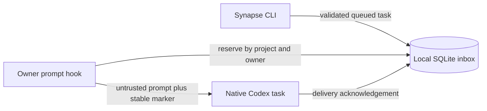

# Architecture

## Data flow

1. The CLI resolves the primary Git checkout and stores a validated task in the
   local inbox.
2. The next owner prompt for that checkout reserves one eligible message. Linked
   worktrees cannot consume messages.
3. The hook instructs Codex to reconcile a stable delivery marker before creating
   or updating the channel's native task.
4. Synapse acknowledges the message only after native delivery succeeds.

Leases are fenced to the original owner session. An expired delivery cannot be
stolen by another owner, and retries preserve the same delivery identity.

## Components

- `src/client/cli.mjs` parses commands and resolves primary Git checkouts.
- `plugins/synapse/lib/inbox.mjs` owns validation, storage, leasing, recovery,
  and acknowledgement.
- `plugins/synapse/hooks/dispatch.mjs` validates hook input and emits routing
  context for one reserved message.
- `plugins/synapse/skills/route-inbox/` describes the plugin routing behavior.
- `test/` contains unit and process-level integration tests.

## Trust boundaries

- Queued task text is untrusted data. It is delivered to a separate native task
  and must never be executed in the owner task.
- The inbox contains task content and native task identifiers. Its directory is
  private to the local user and its SQLite files use owner-only permissions.
- Identifiers have a restricted character set, task and hook payload sizes are
  bounded, and SQL values are parameterized.
- The project has no network listener and stores no service credentials.
- `SYNAPSE_INBOX_PATH` is a trusted local configuration override, primarily for
  isolated tests.

## Compatibility

Schema initialization is additive so existing `0.1.x` inboxes continue to open.
Legacy in-flight records without an owner become `uncertain` and require explicit
recovery rather than automatic redelivery.
