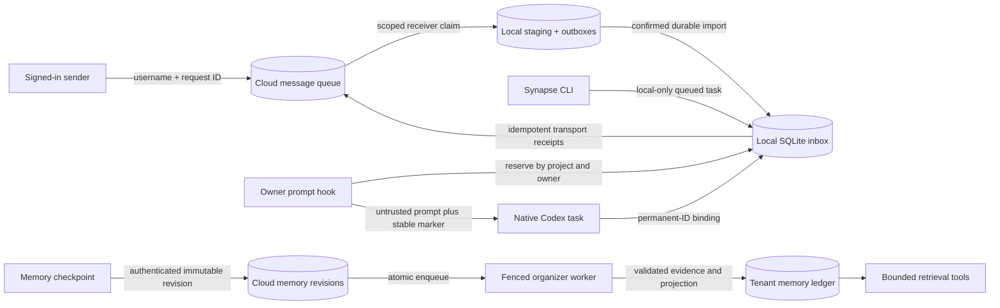

# Architecture

## Data flow

1. The CLI resolves the primary Git checkout and stores a validated task in the
   local inbox.
2. The next owner prompt for that checkout reserves one eligible message. Linked
   worktrees cannot consume messages.
3. A background hook calls Codex desktop's native project-task tools. New task
   creation is provisionally accepted by its temporary client ID, so the owner
   prompt resumes without waiting for worktree setup or a permanent task ID.
4. The delegated child starts independently and binds its permanent task ID from
   the immutable `codex_app/create_thread` delegation record in its transcript.
5. Existing ready channels are continued directly through their permanent task
   ID; no later owner prompt is consumed by reconciliation.

Leases are fenced to the original owner session. Cloud payloads are staged
locally before import confirmation and become routable only after the server
confirms that installation's ownership. Ambiguous native mutations become
`needs_attention`; they are not blindly retried. Public `delivered` is transport
acceptance, not successful execution of the requested work.

## Components

- `src/client/cli.mjs` parses commands and resolves primary Git checkouts.
- `plugins/synapse/lib/inbox.mjs` owns validation, storage, leasing, recovery,
  and acknowledgement.
- `plugins/synapse/hooks/dispatch.mjs` validates hook input and emits routing
  context for one reserved message.
- `plugins/synapse/lib/receiver-*.mjs` implements scoped transport, local account
  binding, Keychain access, staging and receipt synchronization.
- `src/server/messaging/` implements OAuth sender tools and scoped receiver HTTP.
- `src/server/memory-processing/` owns durable job scheduling and project fences.
- `src/server/memory-organizer/` validates inference against immutable revisions
  and commits append-only claims plus a replaceable projection atomically.
- `src/server/memory-retrieval/` serves bounded, authenticated memory reads.
- `src/server/worker/` runs inference separately with explicit credentials/models.
- `test/` contains unit and process-level integration tests.

## Trust boundaries

- Queued task text is untrusted data. It is delivered to a separate native task
  and must never be executed in the owner task.
- The inbox contains task content and native task identifiers. Its directory is
  private to the local user and its SQLite files use owner-only permissions.
- Identifiers have a restricted character set, task and hook payload sizes are
  bounded, and SQL values are parameterized.
- Hosted APIs derive user/project identity from verified authentication; client
  input cannot select an owner, another project, local paths or native task IDs.
- The receiver credential is separate from OAuth, stored in macOS Keychain, and
  scoped only to one opted-in installation. Server storage contains its hash.
- Runtime and organizer-worker database roles are distinct. Forced RLS isolates
  tenants; worker writes additionally bind project identity and a queue fence.
- Exact evidence offsets refer to immutable revision bytes. Organized claims
  retain history; an inference result is not allowed to overwrite its sources.
- Production PostgreSQL connections verify certificates. URL SSL overrides are
  rejected so they cannot disable verification after configuration validation.
- `SYNAPSE_INBOX_PATH` is a trusted local configuration override, primarily for
  isolated tests.

## Compatibility

Schema initialization is additive so existing `0.1.x` inboxes continue to open.
Legacy in-flight records without an owner become `uncertain` and require explicit
recovery rather than automatic redelivery.
